# SAPR

Sistema Administrativo Profesional para Restaurante.

<p align="center">
  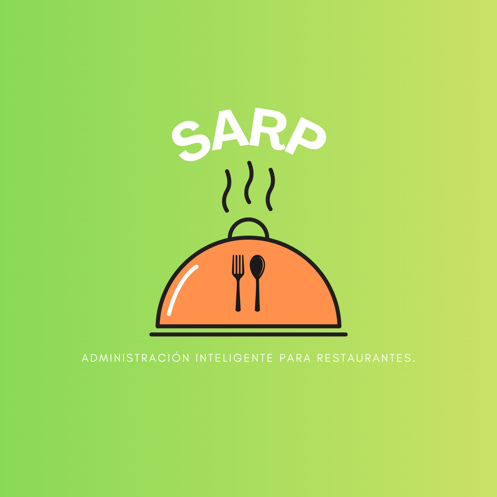
</p>

SAPR es una plataforma full-stack orientada a operacion real de restaurante fisico (single-tenant), enfocada en flujo de salon, cocina y caja con control por roles.

## Tabla de contenido

1. [Vision del producto](#vision-del-producto)
2. [Arquitectura y stack](#arquitectura-y-stack)
3. [Capacidades funcionales](#capacidades-funcionales)
4. [Galeria visual](#galeria-visual)
5. [Modelo operativo de pedidos y comandas](#modelo-operativo-de-pedidos-y-comandas)
6. [Seguridad y permisos](#seguridad-y-permisos)
7. [Estructura del repositorio](#estructura-del-repositorio)
8. [Puesta en marcha local](#puesta-en-marcha-local)
9. [Configuracion](#configuracion)
10. [API principal](#api-principal)
11. [Calidad, build y troubleshooting](#calidad-build-y-troubleshooting)
12. [Roadmap](#roadmap)
13. [Licencia y autoria](#licencia-y-autoria)

## Vision del producto

SAPR busca resolver el ciclo operativo completo de un restaurante:

- Salon: mesas, apertura de pedidos, seguimiento de estado.
- Cocina: comandas digitales con transiciones operativas.
- Caja: registro y conciliacion de pagos.
- Administracion: catalogo, usuarios, roles y analitica.

Alcance actual:

- Modelo single-tenant (una operacion por instancia).
- Sin auto-registro de usuarios (gestion interna).
- Control de acceso basado en roles.
- Flujo pedido/comanda unificado.

## Arquitectura y stack

### Backend

- Java 21
- Spring Boot
- Spring Security + JWT
- Spring Data JPA
- PostgreSQL
- Maven Wrapper

### Frontend

- React + TypeScript
- Vite
- Material UI
- TanStack Query
- React Hook Form + Zod
- Axios

### Estilo arquitectonico

- Backend modular por feature con capas controller, service, repository, entity y dto.
- Frontend organizado por feature folders, hooks de datos y servicios desacoplados.

## Capacidades funcionales

- Autenticacion JWT y recuperacion de contrasena.
- Gestion de usuarios y roles.
- Gestion de mesas y estados.
- Pedidos con ciclo de vida completo.
- Comandas digitales para cocina.
- Productos y categorias con imagenes.
- Pagos por pedido y liberacion de mesa.
- Dashboard + reportes unificados con filtros de tiempo.

## Galeria visual

### Acceso y experiencia inicial

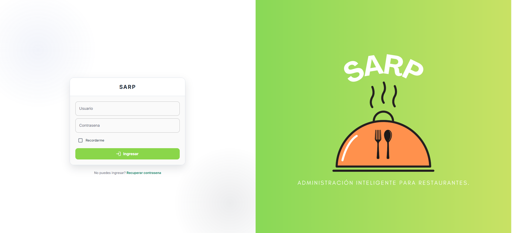

### Operacion de salon

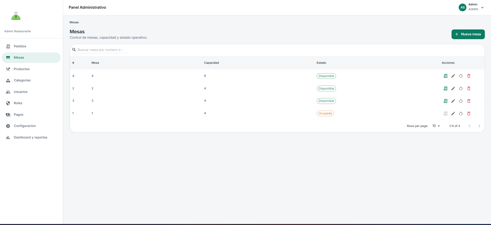

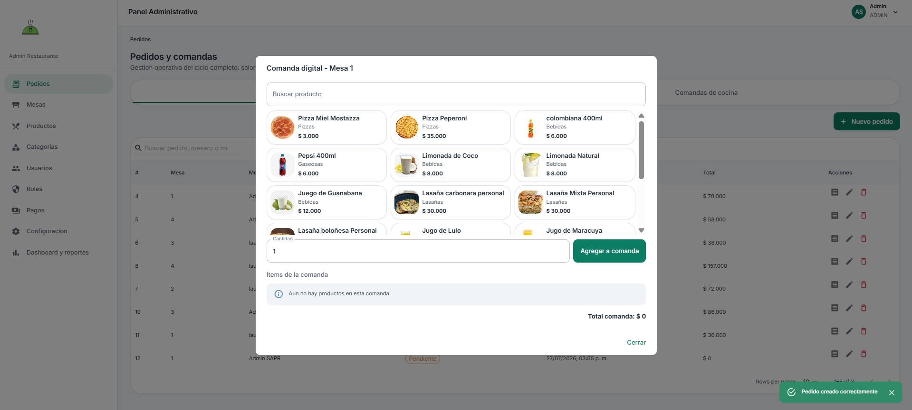

### Operacion de cocina

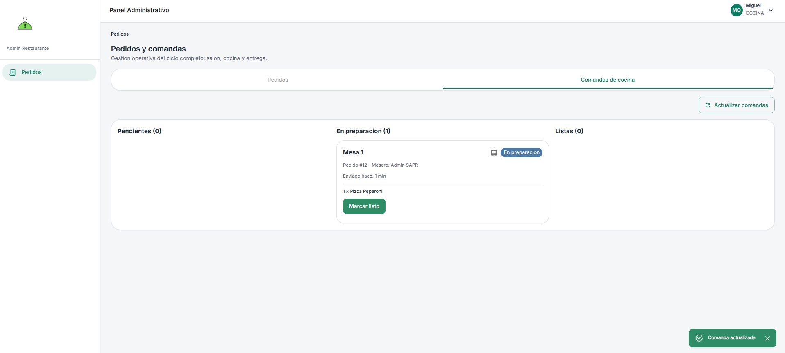

### Administracion comercial

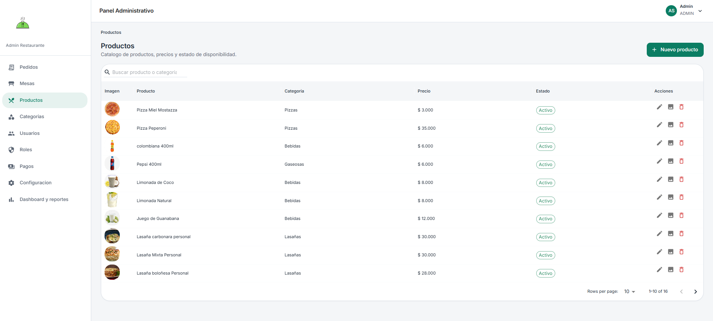

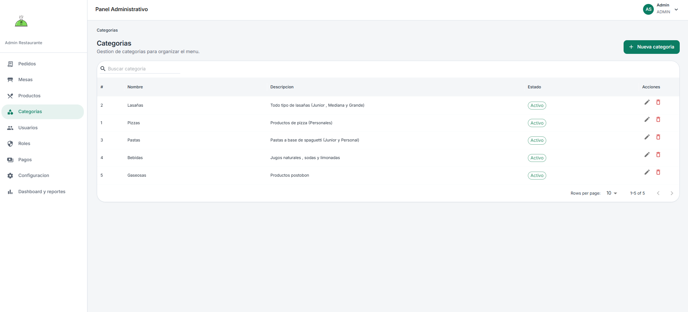

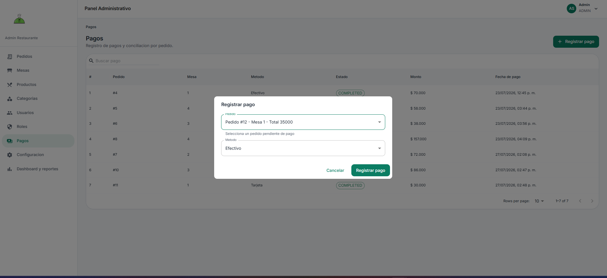

### Administracion de acceso

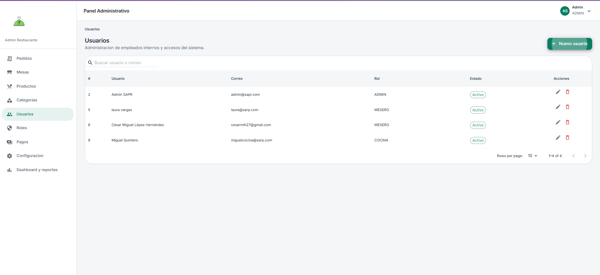

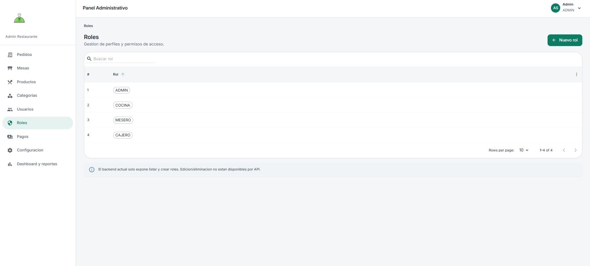

### Analitica y reportes

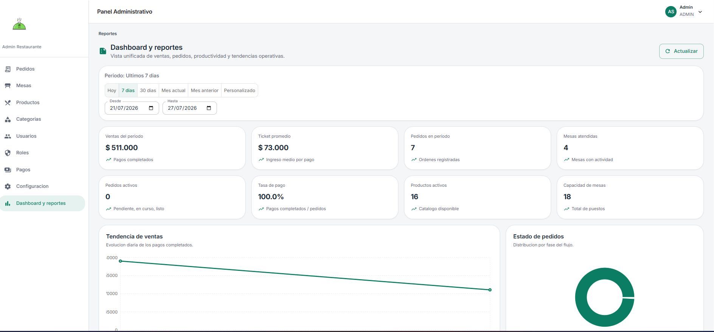

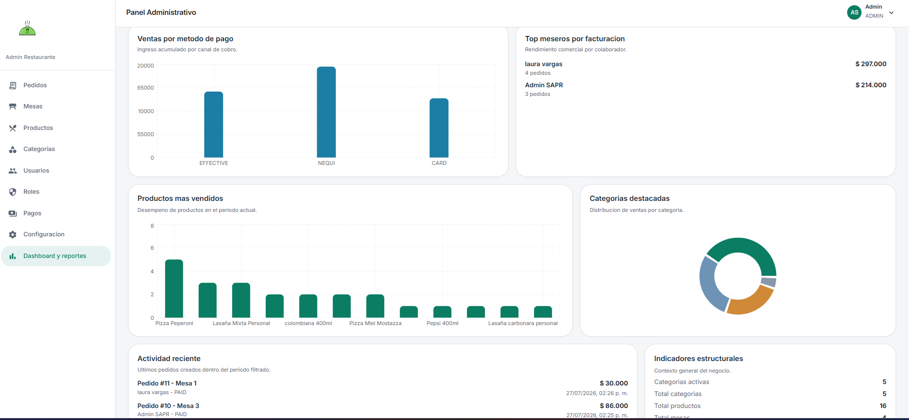

## Modelo operativo de pedidos y comandas

En SAPR, la comanda representa la vista de cocina de un pedido.

Flujo:

1. Apertura de pedido para mesa disponible.
2. Adicion/edicion de items en comanda.
3. Cocina inicia preparacion.
4. Cocina marca pedido listo.
5. Salon entrega.
6. Caja registra pago y cierra ciclo.

Estados del pedido:

`PENDING -> IN_PROGRESS -> READY -> DELIVERED -> PAID`

Reglas clave:

- No se permite iniciar cocina sin items en comanda.
- Los cambios de estado estan restringidos por rol.
- Cancelaciones aplican en etapas controladas.

## Seguridad y permisos

### Endpoints publicos

- `POST /api/auth/login`
- `POST /api/auth/recover-password`
- `POST /api/auth/reset-password`

### Permisos por rol

- `ADMIN`: acceso total.
- `CAJERO`: acceso total operativo y administrativo.
- `COCINA`: gestiona comandas en preparacion y listo.
- `MESERO`: crea/gestiona pedidos propios y comandas asociadas.

### UX defensiva

- El menu se adapta al rol autenticado.
- Rutas no autorizadas muestran pantalla de "Sin privilegios".

## Estructura del repositorio

```text
SAPR/
  backend/     API REST, seguridad, logica de negocio y persistencia
  frontend/    SPA administrativa
```

## Puesta en marcha local

### Requisitos

- Java 21
- Node.js 18+
- PostgreSQL 14+
- Docker (opcional)

### Base de datos por defecto

- Host: `localhost:5432`
- DB: `sapr_db`
- User: `user_sapr`
- Password: `1234`

### 1) Backend

```powershell
cd backend
.\mvnw.cmd spring-boot:run
```

Servicios:

- API: `http://localhost:8080/api`
- Swagger: `http://localhost:8080/swagger-ui`

### 2) Frontend

```powershell
cd frontend
npm install
npm run dev
```

Servicio:

- App: `http://localhost:5173`

### 3) Opcion Docker (backend + db)

```powershell
cd backend
docker compose up --build
```

## Configuracion

### Backend (`application.properties`)

- `SPRING_PROFILES_ACTIVE` (ejemplo: `dev`)
- `JWT_SECRET`
- `JWT_EXPIRATION`
- `CORS_ALLOWED_ORIGINS`
- `APP_FRONTEND_URL`
- `MAIN_ADMIN_EMAIL`
- `MAIL_HOST`
- `MAIL_PORT`
- `MAIL_USERNAME`
- `MAIL_PASSWORD`

### Frontend (`.env`)

- `VITE_API_URL` (default recomendado: `http://localhost:8080/api`)

### Usuario inicial de desarrollo

Si no existe administrador al arrancar, se crea automaticamente:

- Email: `admin@sapr.com`
- Password: `Admin1234!`

Solo para entorno de desarrollo.

## API principal

Recursos principales:

- `/api/auth`
- `/api/users`
- `/api/roles`
- `/api/categories`
- `/api/products`
- `/api/tables`
- `/api/orders`
- `/api/order-details`
- `/api/payments`
- `/api/dashboard`

Adicional para imagenes de producto:

- Upload: `POST /api/products/{id}/image`
- Render: `GET /api/products/{id}/image`

## Calidad, build y troubleshooting

### Build de validacion

```powershell
# frontend
cd frontend
npm run build

# backend
cd backend
.\mvnw.cmd -DskipTests compile
```

### Problemas frecuentes

- `npm rum dev`: typo. Comando correcto: `npm run dev`.
- Error 403 por rol: cerrar sesion e iniciar con usuario de rol permitido.
- CORS: revisar `CORS_ALLOWED_ORIGINS` en backend.
- Conexion DB: validar credenciales y estado del servicio PostgreSQL.

## Roadmap

- Inventario y movimientos de stock.
- Impresion termica de comandas.
- Reporteria avanzada por turno, rango y colaborador.
- Soporte multi-sucursal (sin romper modelo operativo actual).
- Observabilidad y auditoria de eventos.

## Licencia y autoria

Proyecto desarrollado para uso academico/profesional y como base de evolucion para operacion de restaurante.

Si deseas contribuir, puedes proponer mejoras mediante issues y pull requests.
